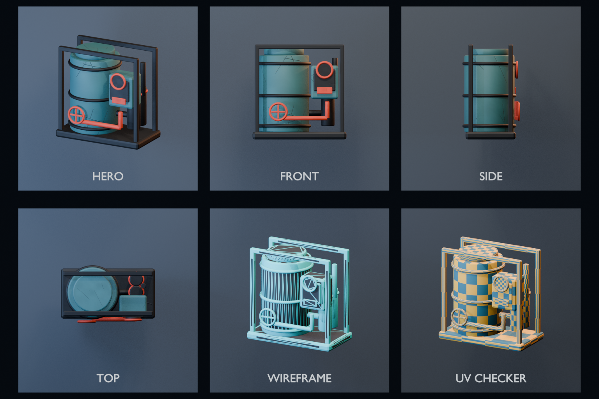

# 纹理化水循环设施 Blender Import Spike

`NW_WaterRecycler_01` 是第二个 Blender → Unity 静态道具证据，目标不是交付正式美术，而是验证以下生产边界能否稳定重放：

- 28 个可编辑来源部件按材质合并为 3 个 Mesh / 3 个材质槽；
- 三个材质族各输出 Base Color、OpenGL 切线空间 Normal、URP Metallic Smoothness 和 Occlusion，共 12 张 512×512 PNG；
- FBX 导出后由 Blender 重新导入，几何统计、封闭拓扑、有效 UV 和纹素密度必须仍成立；
- Blender 输出 Hero / Front / Side / Top / Wireframe / UV Checker 六视图，Unity 校验其字节、尺寸和只用于证据的导入策略；
- Unity 校验来源哈希和贴图语义，配置 Importer、生成外部 URP/Lit 材质、Prefab、Bounds BoxCollider、预览场景和审计报告；
- Contact Sheet 与固定 3D Game View 由人工检查轮廓、材质层级、拓扑 / UV 可读性、法线方向和灯光响应。

它位于 `Spikes/`，可以整体删除，不属于 Runtime Content，也不是已经批准的正式水循环设施。

## 从 Blender 重建

在仓库根目录运行：

```powershell
pwsh -File Tools/ArtPipeline/Blender/run-blender-textured-prop.ps1
```

可重建输出位于被 Git 忽略的：

```text
ArtPipelineOutput/BlenderTexturedProp/NW_WaterRecycler_01/
```

同一次运行生成 `.blend`、FBX、Blender Hero 预览、六视图 Contact Sheet、12 张贴图和 `manifest.json`。若要替换仓库中的跨机器证据，必须从同一次通过的运行复制 FBX、manifest、Contact Sheet 和全部贴图，不能混用不同轮次的文件。

## 在 Unity 中重放

执行菜单：

```text
Assets/SSFramework/游牧工坊/Blender Import Spike/配置并审计纹理化水循环设施
```

Editor 工具会幂等配置并审计：

- Base Color 使用 sRGB；Normal、Metallic Smoothness 与 Occlusion 使用 Linear；
- Normal 以 `TextureImporterType.NormalMap` 导入，不翻转绿色通道；
- `MetallicSmoothness` 的 R 是 Metallic、A 是 Smoothness；
- Occlusion 的 G 是 Occlusion；
- Contact Sheet 使用 sRGB、无 Mip、Clamp、Bilinear 和无压缩的证据导入策略，不进入运行时材质；
- 三个项目自有 `Universal Render Pipeline/Lit` 材质按源材质名显式 Remap；
- Prefab Root / Visual 保持 Identity，只创建一个 Root BoxCollider，不创建 MeshCollider；
- 预览相机复用游戏 Spike 中唯一的次级 Universal Renderer，不复制或改写默认 Renderer2D。

对应 EditMode 契约测试：

```text
Game.NomadWorkshop.Editor.Tests.NomadTexturedPropAssetPipelineTests
```

## Blender Contact Sheet



这张图已人工检查过六个面板的完整性、标签和裁切：主轮廓在正交方向可读，Wireframe 能暴露当前拓扑密度，UV Checker 能暴露缩放与拉伸。它不是“美术已批准”的证明；功能叙事、细节节奏、材质可信度和与车辆场景的组合效果仍需正式 Art Pass。

## 2026-09-01 实测结果

| 项目 | 结果 |
|---|---|
| Harness / manifest | 0.4.0 / schema 3 |
| Blender 来源结构 | 28 Part → 3 Mesh / 3 Material Slot |
| 来源几何 | 3928 Vertex / 7772 Triangle / 0 Degenerate Triangle |
| FBX 回读 | 3 Mesh / 3 Slot / 3928 Vertex / 7772 Triangle / 0 Degenerate Triangle |
| 拓扑与 UV | 来源 / FBX 回读均为 0 Loose / Boundary / Non-manifold Edge、0 Degenerate UV Triangle，三个 Mesh 均有 UV |
| UV 策略 | `overlap-and-repeat-allowed`；UV Loop 均在 0–1，允许共享 / 重叠与材质平铺 |
| 有效纹素密度 | 来源与 FBX 回读均为 1001.091 px/m（面积加权、包含材质平铺） |
| Unity 几何 | 3 Mesh / 3 Renderer / 8083 Runtime Vertex / 7772 Triangle |
| Bounds | Blender 1.460 × 0.895 × 1.475 m；Unity 1.460 × 1.475 × 0.895 m，轴转换后相符 |
| 贴图 | 3 材质族 × 4 PBR Map，共 12 张 512×512 PNG |
| Unity 材质 | 3 个外部 URP/Lit Material，四图契约与 Keyword 审计通过 |
| 交互 | 一个基于 Renderer Bounds 的 Root BoxCollider；无 MeshCollider |
| 人工视觉 | 六视图 Contact Sheet 与固定 Game View 中青 / 黑 / 橙层级、体积、磨损和金属响应可读；仍需正式艺术指导与细节设计 |

初版几何曾出现 48 个零面积三角形：Blender 生成统计是 7820 Triangle，而 Unity 只保留 7772。流程没有放宽容差，而是加入面积检查、`dissolve_degenerate` 清理和 FBX 回读验收，最终来源、FBX 与 Unity 都稳定为 7772。这是本 Spike 最重要的 Harness 证据之一：**导出成功不能替代跨边界回读。**

`1001.091 px/m` 不是唯一 UV 的显存密度或目标平台预算。当前三个共享可平铺材质会重复采样 512×512 贴图；该数字适合验证来源与 FBX 回读没有意外改变 UV / Scale，不足以单独判断画质、内存或是否“密度合理”。

## 当前美术边界

贴图由确定性的程序噪声、划痕和凹坑规则生成，适合验证 PBR 通道、磨损方向和风格色板，不等于经过美术创作的资产。现阶段仍欠缺：

- 与用途相关的接口、管线、阀门、标签、维修口和生活痕迹；
- 基于真实边缘、遮挡和重力方向的 Mesh-specific Wear / Dirt；
- 与车辆甲板、居民比例和正式镜头共同迭代后的形体设计；
- LOD、批量实例、目标平台纹理预算和稳定性能基线。

正式资产若继续沿用该候选，应保留相同 Asset ID 和 Unity 消费契约，但可以完全替换 Mesh、UV 与贴图来源。
